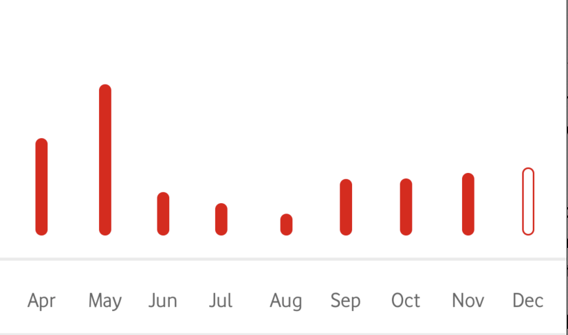

# Chart view Integration Guide

## Overview

Chartview is view located on billing second level page, It contains a collectionView containing bars which represent the bills, The user will have a full graph animation experience when opening billing second level page.

- User can click on the bars to expand/collapse (show/hide bill details)
- Any bar in the chart view when clicked, It animates showing small description of the bill like the bill value, billing period and see bill button which navigates to the bill details screen


ChartView has 3 scenrarios which adapts itself automatically.

- User has more than one bill but less than 12, they can see their bills as bars and 12 months overall with animation.

- User has more than 12 bills, they can see their bills with animation.

- User has more than one bill and the current bill has negative value, the current bill bar will go down indicating that this bill has negative value

# Getting started

- To add `VFGChartView` to your viewController, please do the following:
```
var chartView: VFGChartView?
```
- Then inialize the view as follows:

```
chartView = VFGChartView.loadXib(bundle: Bundle.mva10Billing)

```
- Add the `chartView` to any view and set its constraints
- Now once your data is ready call `configure(dashboardList: [HistoryModel])` like this:
```
chartView.configure(dashboardList: <#T##YourBills#>)
```
Please don't add chartView to your view unless you have more than one bill (2 bills minimum).
Please note that you have to pass the array from the recent bills to oldest (current bill should be the first item).

Please conform to `ChartViewDelegate` to have access over see bill button in the bars and configure the billing period formate

## `ChartViewDelegate`

```
public protocol ChartViewDelegate: class {
    func seeBillButtonPressed(selectedRowInRecentBills: Int)
    var billingPeriodFormat: BillingPeriodFormat { get }
}
```

## `ChartViewDelegate` Implementation Example:

```
extension <#T##YourViewController#>: ChartViewDelegate {
    public var billingPeriodFormat: BillingPeriodFormat {
        return .monthInCharacters
    }
	
    public func seeBillButtonPressed(selectedRowInRecentBills selectedRow: Int) {
	     // navigate to Bill details screen with the selectedRowInRecentBills in your bills array passed to the chart view earlier 
    }
}
```

## Enum `BillingPeriodFormat`

```
public enum BillingPeriodFormat {
    case noBillPeriod
    case monthInCharacters
    case monthInNumbers
}
```
- In case of `noBillPeriod`, the billing period label will be hidden.
- In case of `monthInCharacters`, the billing period label will be in `"dd MMM"` ie; 20 May - 20 Jun
- In case of `monthInNumbers`, the billing period label will be in `"dd.MM."` ie; 20.05.- 20.06.


Now sit back and admire your masterpiece!

{: style= "width:250px"}

{: style="width:250px"}

{: style="width:250px"}

{: style="width:250px"}


